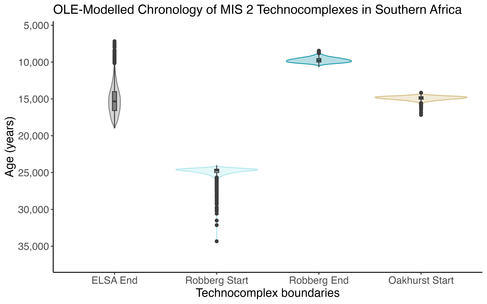
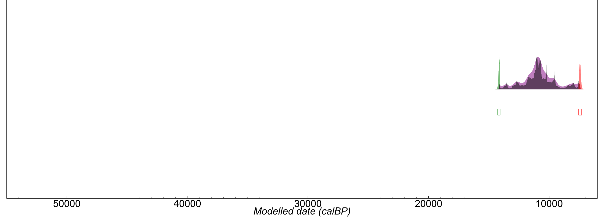
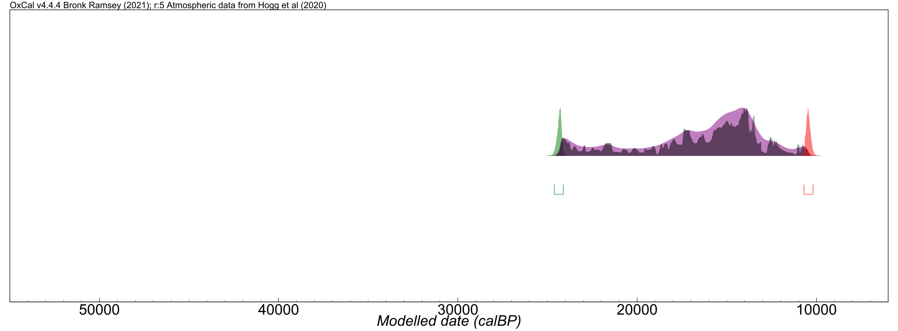
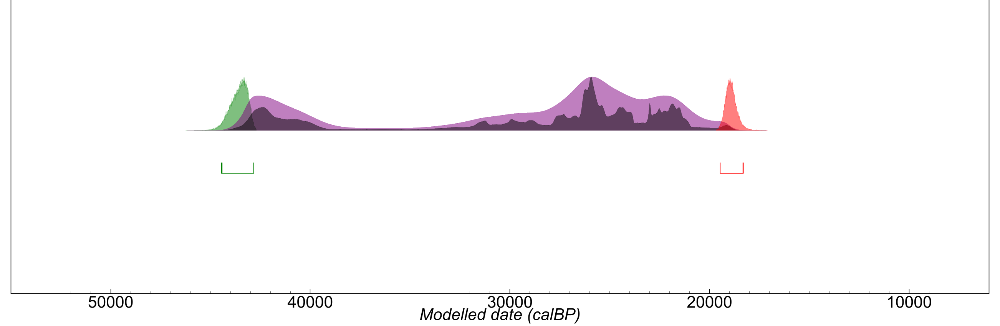
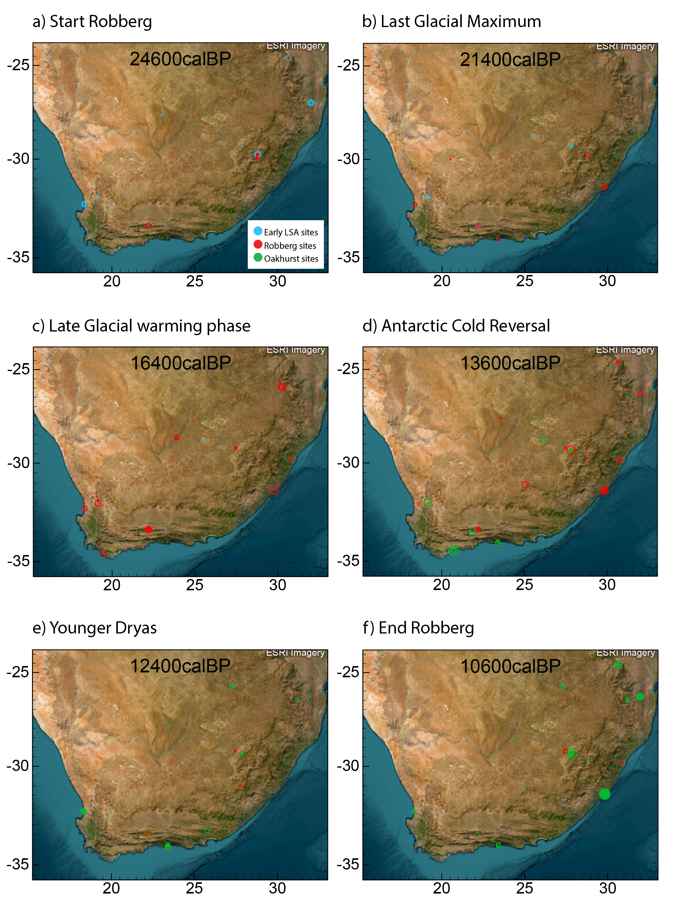

# robberg-chronology-revised
Data and code for a revised chronology of the ELSA, Robberg and Oakhurst traditions in southern Africa during MIS 2. Applies optimal linear estimation and Bayesian age and kernel density modelling to a catalogue of age determinations, proposing a Robberg framework spanning 24.8-9.7 ka.

## Overview

This project uses optimal linear estimation (OLE) and Bayesian age and 
kernel density modelling to estimate the start and end dates of three 
Stone Age traditions from a comprehensive catalogue of radiocarbon and 
OSL age determinations. It proposes a revised framework for the Robberg 
spanning 24.8–9.7 ka and situates it in relation to the climatic 
fluctuations of MIS 2.

## Tools Used

* R
* OxCal

## Folder Structure

* `data/`: input datasets, including the compiled catalogue of age 
  determinations and OLE-formatted input
* `code/`: R script for OLE resampling models, and OxCal scripts for 
  KDE/Bayesian modelling and spatial site plotting
* `results/`: figures, tables, and model output files

## Key Results

I propose a revised chronology for the Robberg technocomplex, spanning 
24.8–9.7 ka, challenging conventional views of its duration. Shifts in 
stone tool production broadly followed a time-transgressive trajectory 
along the subcontinent's west–east precipitation gradient during MIS 2. An 
approximately 5200-year overlap between the Robberg and Oakhurst, however, 
suggests a prolonged transition and more complex dynamics between their 
makers, climate change, and intergroup exchange.

## Associated publication

Arlt, S. 2026. Time revisited: a revised chronology for the Robberg 
technocomplex in southern Africa. [Journal]. 
[DOI to be added once available]

## Data

`MIS2_dates_catalogue.xlsx` compiles age determinations originally 
published in numerous individual sources. When reusing individual dates, 
please also cite the original publication(s) from which they derive, as 
listed in the accompanying Bibliography sheet.

## Licensing

Code in this repository is licensed under the MIT License (see LICENSE).  
The dataset is licensed under CC BY 4.0 (see LICENSE-DATA).

## Acknowledgements

The OLE (Optimal Linear Estimation) resampling script in this repository 
was reproduced and adapted from:

KEY, A. J. M. & PROFFITT, T. 2024. Revising the oldest Oldowan: Updated 
optimal linear estimation models and the impact of Nyayanga (Kenya). 
Journal of Human Evolution, 186, 103468.  
Adapted and shared here with permission from Alastair Key (personal 
communication, 2026).

VIDAL-CORDASCO, M., OCIO, D., HICKLER, T. & MARÍN-ARROYO, A. B. 2022. 
Ecosystem productivity affected the spatiotemporal disappearance of 
Neanderthals in Iberia. Nature Ecology & Evolution, 6, 1644–1657.  
Original code available at: [ERC-Subsilience GitHub repository](https://github.com/ERC-Subsilience/Data-and-code-associated-with-Iberia-Neanderthal-ecosystems-productivity_Nature-Ecology-Evolution)  
Published under the article's CC BY 4.0 licence (Nature Ecology & 
Evolution open access terms).

The `custom_OLE_fun` function is based on the OLE function from the 
sExtinct package:

CLEMENTS, C. F. 2013. sExtinct: Calculates the historic date of 
extinction given a series of sighting events. R package version 1.1. 
URL: http://CRAN.R-project.org/package=sExtinct.

The optimal linear estimation method was introduced to archaeology in:

KEY, A., ROBERTS, D. L. & JARIĆ, I. 2021. Reconstructing the full 
temporal range of archaeological phenomena from sparse data. Journal of 
Archaeological Science, 135, 105479.

## Author

Svenja Arlt

* Postdoctoral Early Career Research Associate, School of Archaeology, 
  University of Oxford https://github.com/SvenjaArlt
